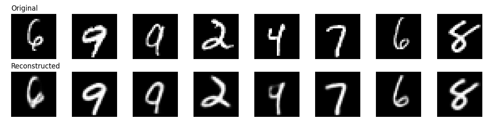
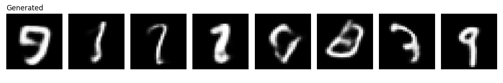
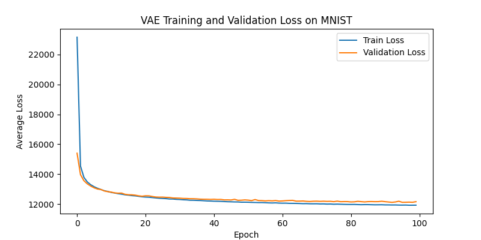

# VAE-CNN-MNIST

A Convolutional Variational Autoencoder (VAE) implemented from scratch in PyTorch, trained on MNIST. Includes a training/validation loop, FID-based quantitative evaluation, and visualizations of reconstructions and latent-space sampling.

## Architecture

- **Encoder**: 3 convolutional layers (1→32→64→128 channels) reducing 28×28 → 7×7 feature maps, followed by separate linear heads producing the mean (μ) and log-variance (log σ²) of a 20-dimensional latent Gaussian distribution.
- **Decoder**: A linear layer expands the latent vector back to 128×7×7, followed by 2 transposed convolutions upsampling to 28×28, and a final convolution with sigmoid activation producing pixel values in [0, 1].
- **Reparameterization trick**: z = μ + σ ⊙ ε, ε ~ N(0, I) — isolates randomness in ε so gradients flow through μ and σ.
- **Loss (ELBO)**: Binary cross-entropy reconstruction loss + closed-form KL divergence regularizing the latent space toward N(0, I).

## Results

| Metric | Value |
|---|---|
| Final FID Score | **21.31** |
| Training epochs | 100 |
| Train / Val split | 80% / 20% (48,000 / 12,000 images) |
| Test set | 10,000 images (held out, used only for final FID) |
| Hardware | NVIDIA RTX 2080 |
| Best checkpoint | Epoch 93 (val loss 12,114.97) |
| Train loss (epoch 1 → 100) | 23,158.70 → 11,925.60 |
| Optimizer | Adam, lr 1e-3, batch size 128 |
| Latent dimension | 20 |

For context, an MLP-based VAE baseline trained under identical conditions achieved FID 39.37 — the CNN architecture's spatial feature preservation roughly halves the FID.

### Reconstructions


Reconstructions are faithful to the originals with sharp edges, preserving digit identity and stroke structure.

### Generated Samples


Samples drawn from the prior z ~ N(0, I) and passed through the decoder show the mild blurriness characteristic of VAEs — a consequence of single-step generation, where the decoder averages over uncertain pixel configurations when generating without an encoded reference.

### Training Curve


## Project Structure
├── model.py                 # Encoder, Decoder, VAE classes

├── train.py                 # Training/validation loop

├── evaluate.py               # FID score computation

├── fid_score.py               # Visualizations (reconstructions, samples, loss curve)

├── results/                  # Generated plots and images

├── best_vae_weights.pth      # Best checkpoint (epoch 93, lowest val loss)

├── final_vae_weights.pth     # Final epoch checkpoint

├── losses.json                # Per-epoch train/val loss history

└── requirements.txt
## Setup

```bash
# Clone the repository
git clone https://github.com/RaniaMostafa0/VAE-CNN-MNIST.git
cd VAE-CNN-MNIST

# Create and activate a virtual environment
python -m venv venv
venv\Scripts\activate        # Windows
# source venv/bin/activate   # macOS/Linux

# Install dependencies
pip install -r requirements.txt
```

## Reproducing Results

```bash
# 1. Train the model (MNIST downloads automatically, ~100 epochs)
python train.py
# Saves: best_vae_weights.pth, final_vae_weights.pth, losses.json

# 2. Compute FID score against the held-out test set
python evaluate.py
# Saves: results/fid_score.json
# Expected: FID ≈ 21.31

# 3. Generate visualizations (reconstructions, samples, loss curve)
python fid_score.py
# Saves: results/reconstructions.png, results/generated.png, results/training_loss.png
```

**Note on reproducibility**: The train/validation split is seeded (`torch.Generator().manual_seed(42)`), but model weight initialization and per-epoch data shuffling are not globally seeded. Reproduced FID should land close to 21.31, but exact bit-for-bit reproduction of the saved weights is not guaranteed.

## Notes

- MNIST is downloaded automatically via `torchvision.datasets.MNIST` and excluded from version control (`.gitignore`).
- This repository is part of a broader comparative study of generative models on MNIST (MLP-VAE, CNN-VAE, and DDPM), evaluating generation quality, architectural trade-offs, and speed vs. fidelity across model families.
